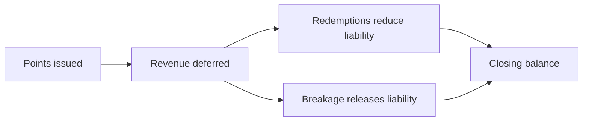

Deferred revenue in Fidivio represents the contract liability for outstanding loyalty points — the monetary value of the performance obligation not yet satisfied.

## How it flows

## Where to view it

- **Deferred Revenue Dashboard** — detailed roll-forward of liability movements
- **IFRS Dashboard** — connection to P&L revenue lines

<CardGroup cols={2}>
  <Card title="Opening balances" href="/user-guide/program-setup/existing-program-balances">
    Set migration opening balances.
  </Card>
  <Card title="Technical calculations" href="/technical-memo/calculations/deferred-revenue-dashboard">
    Deferred revenue calculation detail.
  </Card>
</CardGroup>

## Next steps

- [Financial dashboards](/user-guide/platform-navigation/financial-dashboards)
- [Contract liability background](/technical-memo/background-contract-liability)
