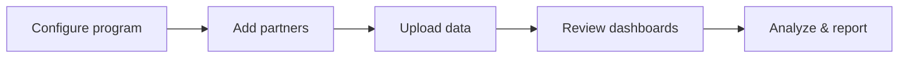

The Fidivio platform is organized into three main areas accessible from the left sidebar: **Dashboards**, **Growth**, and **Setup & Support**.

<Frame caption="Fidivio platform navigation">
  
</Frame>

## Main areas

<CardGroup cols={3}>
  <Card title="Dashboards" icon="chart-line" href="/user-guide/platform-navigation/dashboard-overview">
    Financial metrics, statements, and operational KPIs.
  </Card>
  <Card title="Growth" icon="trending-up" href="/user-guide/platform-navigation/growth-tools">
    Projections and ad-hoc calculations.
  </Card>
  <Card title="Setup & Support" icon="wrench" href="/user-guide/platform-navigation/setup-support">
    Partners, data input, configuration, and help.
  </Card>
</CardGroup>

## Typical workflow

<Steps>
  <Step title="Configure your program">
    Set program details, currencies, opening balances, and accounting rules under **Setup & Support → Configuration**.
  </Step>
  <Step title="Add partners">
    Register accrual and redemption partners before uploading data.
  </Step>
  <Step title="Upload data">
    Enter or batch-upload accruals, redemptions, breakage levels, and other categories.
  </Step>
  <Step title="Review dashboards">
    Validate metrics on Home, Accounting, and Management Reports dashboards.
  </Step>
</Steps>

## Next steps

- [Dashboard overview](/user-guide/platform-navigation/dashboard-overview)
- [Initial setup checklist](/user-guide/getting-started/initial-setup-checklist)
