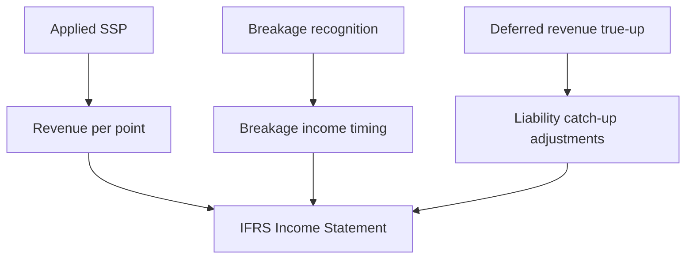

Accounting configuration defines how Fidivio recognizes revenue, breakage, and liability adjustments. These three settings work together to determine your IFRS income statement.

Navigate to **Setup & Support → Configuration → Program Setup → Accounting Configuration**.

<Warning>
Accounting settings should be established at program set-up and applied consistently thereafter. Changing settings mid-program applies the latest configuration retrospectively to all historical data.
</Warning>

## Three settings

<CardGroup cols={3}>
  <Card title="Setting 1: Applied SSP" icon="tag" href="/user-guide/program-setup/applied-ssp">
    Is the standalone selling price adjusted for expected breakage?
  </Card>
  <Card title="Setting 2: Breakage recognition" icon="clock" href="/user-guide/program-setup/breakage-recognition">
    How and when is breakage recognized as revenue?
  </Card>
  <Card title="Setting 3: Deferred revenue true-up" icon="scale" href="/user-guide/program-setup/deferred-revenue-true-up">
    How is deferred revenue adjusted for estimate changes?
  </Card>
</CardGroup>

## How they interact

Together these settings control the revenue recognition and adjustment logic of the model.

<Tip>
Start with the recommended defaults (Applied SSP = Yes, Breakage Recognition = Setting 1, True-up = Setting 1) unless your accounting policy requires otherwise.
</Tip>

## Next steps

- [Applied SSP](/user-guide/program-setup/applied-ssp)
- [Breakage recognition](/user-guide/program-setup/breakage-recognition)
- [Deferred revenue true-up](/user-guide/program-setup/deferred-revenue-true-up)
- [Revenue recognition logic](/user-guide/program-setup/revenue-recognition-logic)
